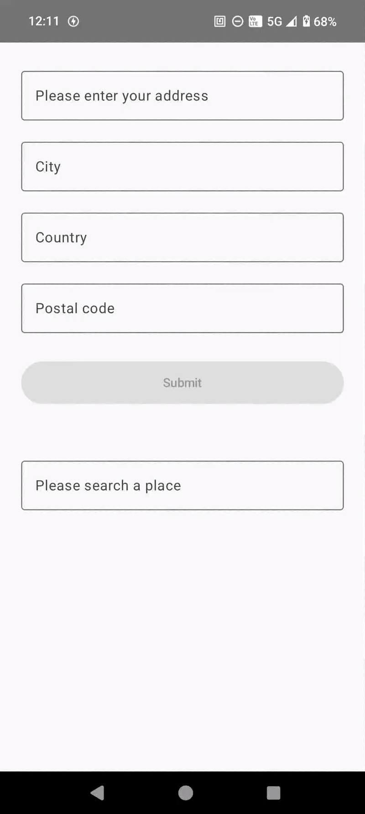

# KMP Places Autocomplete 📌
[](http://kotlinlang.org)
[](https://github.com/JetBrains/compose-multiplatform)


## Introduction
A simple Compose Multiplatform library to fill addresses, cities and countries in a form, based on Google
Places API by
Google https://developers.google.com/maps/documentation/places/web-service/autocomplete.
For Android and IOS

# Demo


## ⚙️ Setup
Please generate a valid Google Places API key and add it to your project. You can find the instructions to generate key on Google docs: https://developers.google.com/maps/documentation/places/web-service/get-api-key
Use KMPPlaces.initialize(apiKey) to initialize the library.
```kotlin 
android - KMPPlaces.initialize(apiKey) - normally in src/androidMain/MainActivity
ios - KMPPlaces.initialize(apiKey) - normally in src/iosMain/MainViewController
```
Then add the dependency to your project:

```kotlin
repositories {
    mavenCentral()
}

dependencies {
    implementation("io.github.ngallazzi:KMP-Places-Autocomplete:<LAST_VERSION>")
}
```

## Usage
Just put **AddressAutocompleteForm** or **PlaceAutoCompleteTextField** composable within your app theme. Handle state from related lambda

```kotlin
// If you need the complete form
@Composable
fun MyLayout(){
    MaterialTheme {
        AddressAutocompleteForm(
            modifier = Modifier.fillMaxWidth().padding(24.dp),
            onSubmit = { state ->
                // Handle state changes here
            })
    }
}

// If you have your own layout and you only need the autocomplete field with its details
@Composable
fun MyLayout(){
    MaterialTheme {
        Column {
            PlaceAutoCompleteTextField(
                label = "Please search a place",
                modifier = Modifier.fillMaxWidth().padding(24.dp),
                onSuggestionSelected = { placeDetails ->
                    placeDetailsState = placeDetails
                })
        }
    }
}

```
## 💬 Feedback
Please feel free to open an issue if you have any feedback or suggestions. PRs are welcome too!

## ©️ Credits

KMP Places Autocomplete is brought to you by
these [contributors](https://github.com/ngallazzi/KMP-Places-Autocomplete/graphs/contributors).

## 📜 License

This project is licensed under the GNU GENERAL PUBLIC LICENSE - see
the [LICENSE.md](https://github.com/ngallazzi/KMP-Places-Autocomplete/blob/main/LICENSE) file for details
